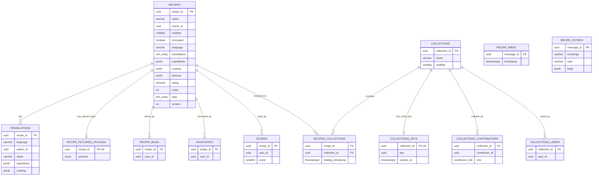

# ChefBook Backend Recipe Service

The recipe service owns recipes, recipe book state, favourites, ratings, translations, recipe pictures, collections, collection sharing, recipe policy reads, and recipe-related MQ events.

## Responsibilities

- Recipe CRUD and recipe read models.
- Recipe book and favourite state.
- Collection CRUD, collection membership, and collection invite keys.
- Recipe-to-collection binding.
- Recipe rating and vote aggregation.
- Recipe translations.
- Recipe picture upload coordination through object storage.
- Recipe policy checks for other services.
- Firebase recipe import through MQ when configured.

## Main RPC Families

- `GetRecipes`, `GetRandomRecipe`, `GetRecipeBook`
- `CreateRecipe`, `GetRecipe`, `UpdateRecipe`, `DeleteRecipe`
- `GenerateRecipePicturesUploadLinks`, `SetRecipePictures`
- `RateRecipe`
- `SaveRecipeToRecipeBook`, `RemoveRecipeFromRecipeBook`
- `SaveRecipeToFavourites`, `RemoveRecipeFromFavourites`
- `AddRecipeToCollection`, `RemoveRecipeFromCollection`, `SetRecipeCollections`
- `TranslateRecipe`, `DeleteRecipeTranslation`
- `GetRecipePolicy`, `GetRecipeNames`
- `GetCollections`, `CreateCollection`, `GetCollection`, `UpdateCollection`, `DeleteCollection`
- `SaveCollectionToRecipeBook`, `RemoveCollectionFromRecipeBook`

## Dependencies

- Calls `profile` for user/profile read data.
- Calls `tag` for tag lookup and tag maps.
- Calls `encryption` for encrypted recipe key coordination.
- Uses S3-compatible object storage for recipe pictures.
- Publishes and consumes MQ messages when configured.
- Owns its PostgreSQL schema and migrations.

## Database Ownership

Owns:

- `recipes` - recipe content, visibility, encryption flag, language, pictures, rating, tags, version.
- `translations` - per-recipe translation content.
- `recipe_pictures_uploads` - pending picture upload state.
- `recipe_book` - saved recipe state per user.
- `favourites` - favourite recipe state per user.
- `scores` - rating state per user.
- `collections` - collection metadata.
- `collections_keys` - collection invite keys.
- `collections_contributors` - collection edit membership.
- `collections_users` - saved collection state per user.
- `recipes_collections` - recipe-to-collection binding.
- `inbox` and `outbox` - MQ idempotency and outgoing events.

Important constraints:

- Encrypted recipes cannot be public.
- Translations are unique by recipe, language, and author.
- Pair tables are unique by their pair keys.
- User IDs are logical references to auth/user/profile domains, not database foreign keys.
